<h2 align="left">Hi 👋! My name is Sameer.</h2>

###

  

###

<h2 align="left">About Me:</h2>

###

- Computer Science student at FAST NUCES - Aspiring Game Developer

###

<h2 align="left">Skills:</h2>

###

  
  
  
  
  
  
  
  
  
  
  

###

<h2 align="left">Socials:</h2>

###

  
  
  

###

<h2 align="left">Stats:</h2>

###

###

  

